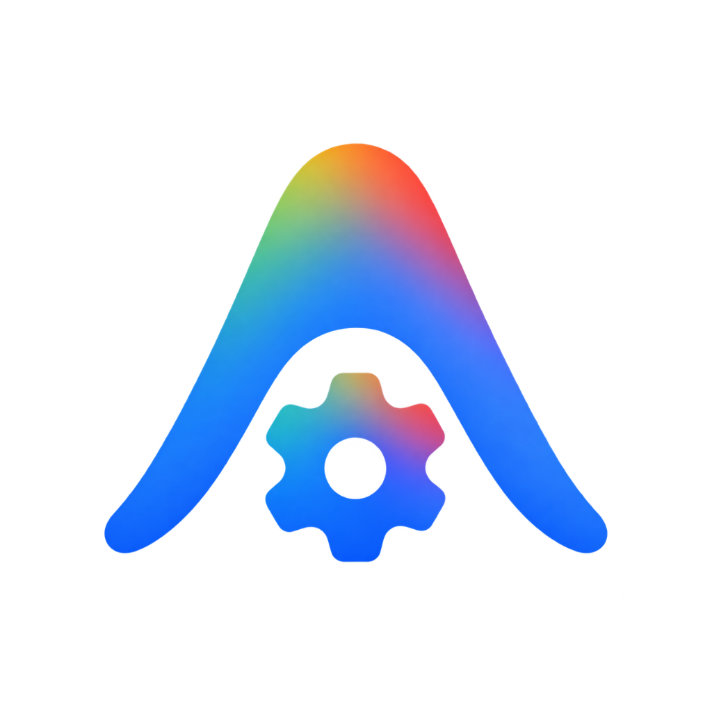
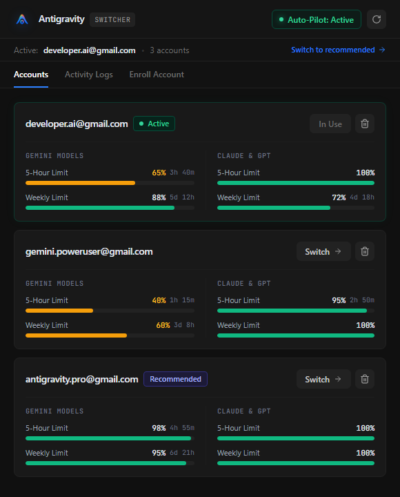
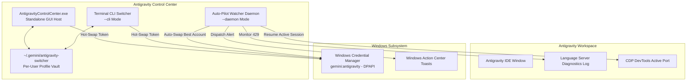

<div align="center">

  

  # Antigravity Control Center

  **Autonomous Multi-Account Orchestrator, Quota Radar & Overnight Task Continuity**

  [](https://github.com/demusraph/antigravity-account-switcher/releases)
  [-0078D6?style=flat-square&logo=windows&logoColor=white)](https://microsoft.com)
  [](#-quick-start)
  [-101010?style=flat-square)](#-antigravity-native-obsidian-design)
  [](#-security--privacy-first)
  [](LICENSE)

  <br>

  

</div>

<br>

## ⚡ Overview

**Antigravity Control Center** is a high-performance desktop management system designed to eliminate quota exhaustion barriers (`RESOURCE_EXHAUSTED` / HTTP 429) across Gemini and Claude AI models.

Rather than forcing developers to manually log out, restart applications, or interrupt long-running tasks, Antigravity Control Center provides instantaneous **hot-swapping via Windows Credential Manager**, live **multi-account quota radar telemetry**, and an **autonomous overnight auto-pilot** that intercepts rate limits and resumes unfinished AI tasks via Chrome DevTools Protocol (CDP).

---

## ✨ Key Capabilities

### 🔄 Zero-Loss Credential Hot-Swapping
- Swaps active authentication tokens directly inside the Windows Credential Manager (`gemini:antigravity`) via native Win32 DPAPI (`advapi32.dll`).
- **Preserves Editor State**: Open tabs, SQLite caches (`state.vscdb`), prompt histories, and terminal workspaces remain completely undisturbed during switches.

### 🤖 Autonomous Overnight Auto-Pilot (CDP Integration)
- A decoupled, low-overhead background daemon that monitors language server diagnostics in real time.
- **Self-Healing Execution Cycle**:
  1. Detects `RESOURCE_EXHAUSTED` (429) exceptions.
  2. Evaluates the multi-account pool and selects the account with the highest available quota.
  3. Hot-swaps the active OS credentials in milliseconds.
  4. Interfaces with the local **Chrome DevTools Protocol (CDP)** endpoint to automatically trigger task resumption—enabling autonomous, uninterrupted overnight agent runs while you sleep.
  5. Emits unobtrusive native Windows toast notifications upon state transitions.

### 📊 Real-Time Multi-Account Quota Radar
- Live telemetry calculation querying official OAuth endpoints for:
  - **Gemini Models** (5-Hour Sliding Window & Weekly Token Limit)
  - **Claude & GPT Models** (5-Hour Window & Weekly Quota)
  - **Dynamic Reset Deltas** (e.g., `3h 48m`, `5d 12h`)
- Algorithmic score ranking that automatically flags the optimal backup account with a `Recommended` badge and enables a 1-click quick-switch action.

### 🖤 Antigravity Native Obsidian Design
- Precision UI adhering 1:1 to official Antigravity dark obsidian design tokens:
  - Canvas: `#101010`
  - Elevated Surfaces: `#191919`
  - Dividers & Outlines: `#222222` hairline borders
  - Interactive Accent: `#2B7FFF` Antigravity Electric Blue
- **Zero-Emoji Discipline**: Professional, clutter-free typography and Lucide vector iconography.
- System Tray integration with silent background minimization (`Hide to Tray`).

---

## 🏗️ Technical Architecture



---

## 🚀 Quick Start

### Option 1: Standalone Executable (No Python Required)
1. Download the latest **`AntigravityControlCenter-Windows-x64.zip`** from [Releases](https://github.com/demusraph/antigravity-account-switcher/releases).
2. Extract the archive anywhere on your machine.
3. Run **`AntigravityControlCenter.exe`**.

### Option 2: Run from Source (Python 3.10+)
```bash
# 1. Clone the repository
git clone https://github.com/demusraph/antigravity-account-switcher.git
cd antigravity-account-switcher

# 2. Install dependencies
pip install -r requirements.txt

# 3. Launch Desktop GUI
Launch-GUI.bat
# or: pythonw agy_app.pyw

# 4. Launch Interactive CLI
Launch-CLI.bat
# or: python agy_switcher.py
```

### Option 3: Install Desktop Shortcut
Double-click **`Create-Desktop-Shortcut.bat`** to instantly install a desktop shortcut with the official iridescent gear icon.

---

## 🔒 Security & Privacy First

1. **Native DPAPI Encryption**:
   - Accounts are stored locally on your machine using Windows Data Protection API (DPAPI).
   - Sensitive tokens are **never** written in plain text to disk or synced to third-party servers.
2. **Zero Cloud Telemetry**:
   - 100% offline-capable and localhost-bound (`127.0.0.1`).
   - No external trackers, analytics, or telemetry beacons.
3. **Transparent & Auditable**:
   - Fully open-source codebase with minimal dependencies.

---

## 📁 Repository Structure

```text
antigravity-account-switcher/
├── .github/workflows/
│   └── build-exe.yml           # Automated CI/CD Release & Packaging pipeline
├── assets/
│   ├── app_icon.png            # High-resolution brand mark
│   └── showcase.png            # Clean UI showcase screenshot
├── agy_app.pyw                 # Unified Desktop GUI application host
├── agy_switcher.py             # High-speed terminal CLI switcher
├── agy_daemon.py               # Autonomous Auto-Pilot background daemon
├── Launch-GUI.bat              # Universal launcher for Desktop GUI
├── Launch-CLI.bat              # Universal launcher for Terminal CLI
├── Create-Desktop-Shortcut.bat # 1-Click desktop shortcut installer
├── requirements.txt            # Python dependencies (PyQt5, PyQtWebEngine)
├── app_icon.ico                # Multi-resolution Windows application icon
├── app_icon.png                # High-res transparent PNG icon
├── .gitignore                  # Filter for caches, logs, and session profiles
├── LICENSE                     # MIT Open Source License
└── README.md                   # Technical documentation
```

---

## 📄 License

Distributed under the **MIT License**. See [`LICENSE`](LICENSE) for details.
